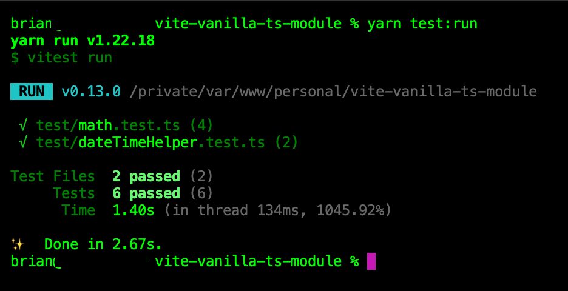

# vite-vanilla-ts-module

<p align="center">
    
    
    
    
</p>

<p align="center">
    
    
</p>

This is a `vite` boilerplate project, created via `vanilla-ts` template. Primarily, for rapid `ts` supported modules for publishing onto `npm`.


## Getting Started

```
yarn
yarn prepare
npx husky add .husky/pre-commit "yarn build"
npx husky add .husky/pre-commit "yarn prettier"
```

Lastly, your file `.husky/pre-commit` should look like below:

```
#!/bin/sh
. "$(dirname "$0")/_/husky.sh"

yarn build
yarn prettier
```

## Testing with Vitest

Run `yarn test:run` or `yarn test:coverage` to produce code coverage report.



The code coverage report will indicate, if all test cases are 100% covered, flawed logic and so on.

## Running `vite`

Run `yarn dev` to open `index.html` via `http://localhost:3000`.

It contains some quick links, to the `stats.html` and coverage `index.html` files.


## Publishing

And when ready to publish to `npm`:

```
npm login
npm publish
```
