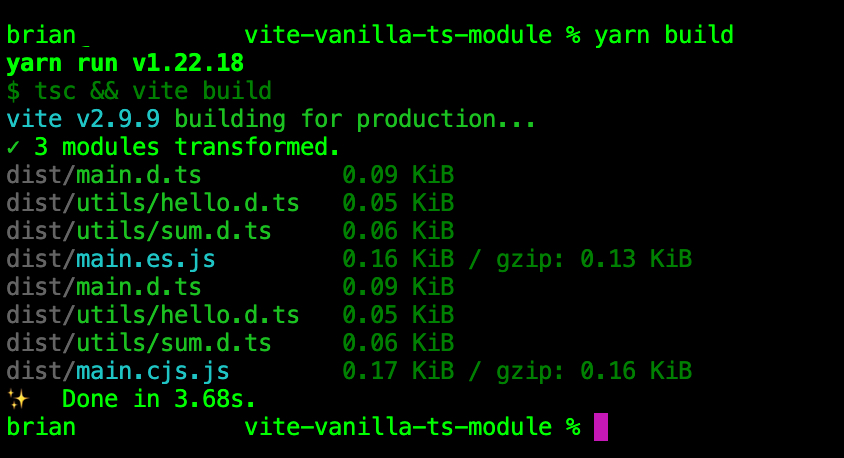

# vite-vanilla-ts-module

<p align="center">
    
    
    
    
</p>

This is a `vite` boilerplate project, created via `vanilla-ts` template. Primarily, for rapid `ts` supported modules for publishing onto `npm`.



## Getting Started

```
yarn
npx husky add .husky/pre-commit "npx sort-package-json"
npx husky add .husky/pre-commit "yarn prettier"
```

Lastly, your file `.husky/pre-commit` should look like below:

```
#!/bin/sh
. "$(dirname "$0")/_/husky.sh"

npx sort-package-json
yarn prettier
```

And when ready to publish to `npm`:

```
npm login
npm publish
```
