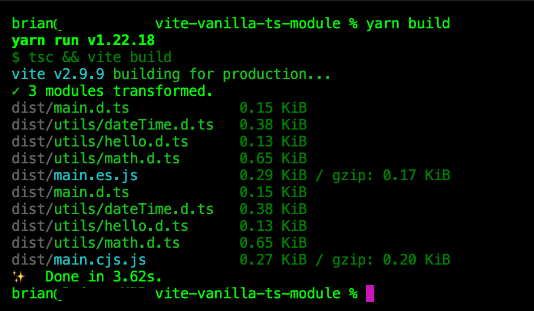

# vite-vanilla-ts-template-extended (AKA `vite-vanilla-ts-module`)

<p align="center">
    
    
    
    
    
</p>

<p align="center">
    
    
</p>

> Update: If you prefer a minimalist vite-vanilla-ts-template, check out https://github.com/entwurfhaus/vite-vanilla-ts-template.

A starter `vanilla-ts` (extended) template that began with Vite 3.x, prepared for writing `node` utility libraries in `typescript`. This starter is meant to provide rapid `node` package development and publishing onto `npm`.



## What is in this template?

Below are notable dependencies bundled (and configured) in this library template:

1. [husky](https://typicode.github.io/husky/get-started.html)
1. [vitest](https://vitest.dev/)
1. [vitest ui](https://vitest.dev/guide/ui.html)
1. [vite](https://vitejs.dev/guide/)
1. [vite-plugin-dts](https://github.com/qmhc/vite-plugin-dts)
1. [vite-plugin-eslint](https://github.com/gxmari007/vite-plugin-eslint)
1. [eslint](https://eslint.org/)
1. [prettier](https://prettier.io/)

### Optional dependencies

And notable optional dependencies, great to use for improved DX etc:

1. [commitlint](https://commitlint.js.org/guides/getting-started.html) - optional, remove if yourself / team does not require enforcing conventional commits.
1. [vite-plugin-progress](https://github.com/jeddygong/vite-plugin-progress) - optional, remove if yourself / team does not require :sparkles: fancy :sparkles: progress bar in terminal.
1. [@trivago/prettier-plugin-sort-imports](https://github.com/trivago/prettier-plugin-sort-imports) - optional, auto-sort your import order in each file, set your own "sort rules".

### Goal of included dependencies

Know that the above dependencies are (mostly) optional, and you may extend or remove them to your preference. The goal of introducing these dependencies as part of the template, is to:

1. Easily build a custom `node` library, fast (with some style).
1. Easily integrate the built custom `node` library, into any monorepo framework - primarily `turborepo` and `nx`.
1. Reduce overhead management of dependencies. For example, you can add [taze](https://github.com/antfu/taze) library.
1. Providing comfort in utilising efficient (linting, auto-sort, etc) productivity features.
1. Improving the overall developer experience (DX) with this template.

## Getting Started

Let's install our dependencies, then pre-setup our `husky` pre-commits:

```bash
yarn
yarn prepare
npx husky add .husky/pre-commit "yarn build"
npx husky add .husky/pre-commit "yarn prettier"
```

Then, your `.husky/pre-commit` file should look like below:

```bash
#!/bin/sh
. "$(dirname "$0")/_/husky.sh"

yarn build
yarn prettier
```

And since we introduced [commitlint](https://commitlint.js.org/guides/getting-started.html), we can enforce "conventional commit" messages with `husky`:

```bash
echo "export default { extends: ["@commitlint/config-conventional"] };" > commitlint.config.js
```

## Testing with Vitest

Run `yarn test` or `yarn test:coverage` to produce code coverage report.

The code coverage report will indicate, if all test cases are 100% covered, flawed logic and so on.

## Running `vite`

Run `yarn dev` to open `index.html` via `http://localhost:5174`.

It contains some quick links, to the `stats.html` and coverage `index.html` files.


## Build your package

Run `yarn build`, and check the `dist` folder for the final build output.

> If there are issues with the package, check `package.json` (props `main`, `module`, `typings`, `files` and etc), `tsconfig.json` (such as `allowJs`) and dependency versions (especially `vite`) to narrow down the build or typings errors you're experiencing.

## Publishing

And when ready to publish to `npm`:

```
npm login
npm publish
```
